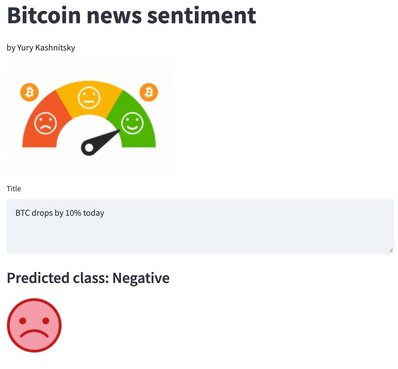

# Cryptonews sentiment classification model

A simple cryptonews sentiment classification app.

The model (simple tf-idf & logreg) is trained with ~4500 news titles manually classiified into positive, neutral or negative.

Launching the app:

 - install requirements from `requirements.txt`
 - execute `streamlit run src/app.py`
